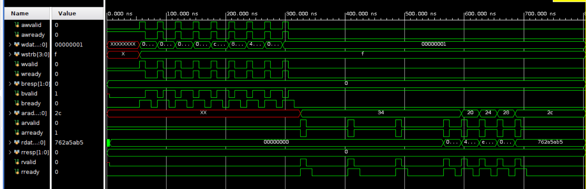

# AES-128 Encryption/Decryption SoC Accelerator

A high-performance AES-128 encryption/decryption engine in SystemVerilog, integrated with a pipelined AXI4-Lite slave interface and verified using a full UVM environment against NIST FIPS-197 Known Answer Test (KAT) vectors. Targets the Xilinx Artix-7 (PYNQ-Z2 / Basys 3).

---

## Table of Contents
- [Overview](#overview)
- [Architecture](#architecture)
- [AXI4-Lite Interface](#axi4-lite-interface)
- [UVM Verification Environment](#uvm-verification-environment)
- [Simulation Waveform](#simulation-waveform)
- [Performance & Results](#performance--results)
- [Tools & Target Platform](#tools--target-platform)
- [Project Structure](#project-structure)
- [How to Run](#how-to-run)

---

## Overview

This project implements a complete AES-128 SoC accelerator with the following highlights:

- Iterative AES-128 engine supporting both encryption and decryption, completing in **11 clock cycles**
- Pipelined AXI4-Lite slave with unified register buffer, Fmax **~102.72 MHz** (WNS +0.265 ns at 100 MHz)
- Full UVM testbench with constrained-random stimulus, reference predictor, automated scoreboard, and **100% functional coverage** against NIST KAT vectors

---

## Architecture

```
         AXI4-Lite Master (Host / PS)
                    |
         ┌──────────▼──────────┐
         │   AXI4-Lite Slave   │
         │  (Unified Reg Buffer│
         │   + AXI Handshaking)│
         └──────────┬──────────┘
                    │
         ┌──────────▼──────────┐
         │    AES-128 Engine   │
         │  ┌───────────────┐  │
         │  │  Key Schedule │  │
         │  │  (ExpandKey)  │  │
         │  └───────┬───────┘  │
         │  ┌───────▼───────┐  │
         │  │  SubBytes     │  │
         │  │  ShiftRows    │  │
         │  │  MixColumns   │  │
         │  │  AddRoundKey  │  │
         │  └───────────────┘  │
         └──────────┬──────────┘
                    │
              128-bit Ciphertext / Plaintext Output
```

The AES engine is iterative — one round per clock cycle. The encryption and decryption cores run in parallel; `enc_dec_en` steers the start pulse and output mux.

---

## AXI4-Lite Interface

Memory-mapped register interface (32-bit words, byte-addressable):

| Offset       | Name       | Access     | Description                          |
|--------------|------------|------------|--------------------------------------|
| 0x00 – 0x0C  | KEY[3:0]   | Write      | 128-bit AES key (4 × 32-bit words)   |
| 0x10 – 0x1C  | DIN[3:0]   | Write      | 128-bit plaintext / ciphertext input |
| 0x20 – 0x2C  | DOUT[3:0]  | Read-only  | 128-bit output (written by AES core) |
| 0x30         | CTRL       | Write      | [0]=start [1]=enc_dec_en [2]=key_en  |
| 0x34         | STATUS     | Read/Write | [0]=done (set by core, clearable)    |
| 0x38 – 0x3C  | —          | —          | Reserved                             |

**Key design decisions:**
- Unified `slv_mem` array for all register I/O — avoids multiple-driver conflicts that arise from separate write/read/DUT output paths
- Rising-edge detect on CTRL[0] generates a clean one-cycle start pulse — prevents re-triggering if the master writes the register multiple times
- Priority-encoded write logic (AES done > start pulse > AXI write) in a single `always_ff` block
- Output registers [8–11] are write-protected from AXI master; only the AES core can update them
- Auto-clear of STATUS[0] on start pulse ensures done flag is never stale across back-to-back operations

---

## 🧪 UVM Testbench Architecture

```text
+--------------------------------------------------+
|                 UVM Testbench                    |
|                                                  |
|   +----------+      +-------------------------+  |
|   | Sequence | ---> | AXI4-Lite Driver       |   |
|   +----------+      +-----------+-------------+  |
|                                   |              |
|                                   v              |
|                          +------------------+    |
|                          |       DUT        |    |
|                          +------------------+    |
|                                   |              |
|   +----------+ <-------------------+             |
|   | Monitor  |                                   |
|   +----+-----+                                   |
|        |                                         |
|        v                                         |
|   +--------------------------+                   |
|   |       Scoreboard         |                   |
|   |   (Checker + Predictor)  |                   |
|   +--------------------------+                   |
|                                                  |
+--------------------------------------------------+
```

- **Constrained-random sequences** — randomised key and plaintext across full 128-bit space
- **Reference predictor** — software AES model runs in parallel, feeds expected outputs to scoreboard
- **Automated scoreboard** — flags any mismatch with full transaction context
- **NIST KAT directed tests** — all FIPS-197 Appendix B vectors run as directed test cases
- **Functional coverage** — cover groups on enc/dec modes, boundary values, back-to-back transactions

---

## Simulation Waveform



The waveform captures a complete AXI4-Lite transaction:

- **0–300 ns** — Write phase: `awvalid`/`awready` and `wvalid`/`wready` handshaking loads key and plaintext registers. `bvalid` confirms each write response.
- **300–500 ns** — AES core processes 11 encryption rounds internally.
- **500–700 ns** — Read phase: `arvalid`/`arready` steps through output register offsets `0x20 → 0x24 → 0x28 → 0x2C`. `rdata` returns ciphertext word `762a5ab5` on the final read.

---

## Performance & Results

| Metric                     | Value                          |
|----------------------------|--------------------------------|
| Target Clock               | 100 MHz                        |
| Fmax (achieved)            | ~102.72 MHz                    |
| WNS                        | +0.265 ns                      |
| AES Core Latency           | 11 cycles                      |
| Full System Latency        | ~40 cycles (inc. AXI overhead) |
| Throughput                 | 320 Mbps                       |
| AXI Bus Bandwidth (raw)    | 1.6 Gbps                       |
| Bus Efficiency             | ~20%                           |
| Functional Coverage        | 100% (NIST KAT verified)       |

---

## Tools & Target Platform

| Item         | Detail                          |
|--------------|---------------------------------|
| FPGA         | Xilinx Artix-7 XC7A35T          |
| Board        | Basys 3 / PYNQ-Z2               |
| Toolchain    | Vivado 2024.x                   |
| Simulator    | ModelSim / Vivado Simulator     |
| HDL          | SystemVerilog (IEEE 1800-2017)  |
| Standard     | NIST FIPS-197                   |

---

## Project Structure

```
├── AES_encryption_decryption_top.v   # Top-level enc/dec wrapper
├── AES_encryption_core.v             # Iterative encryption FSM
├── AES_decryption_core.v             # Iterative decryption FSM (Equivalent Inverse Cipher)
├── AES_AXI_Lite_slave.sv             # AXI4-Lite slave + register map
├── ExpandKey.v                       # AES key schedule (one round per call)
├── SubBytes.v / InvSubBytes.v        # Byte substitution using S-Box lookup
├── ShiftRows.v / InvShiftRows.v      # Row shift (combinational)
├── MixColumns.v / InvMixColumns.v    # Column mix (GF(2^8) arithmetic)
├── sbox.v / InvSbox.v                # S-Box and inverse S-Box primitives
├── mix_single_column.v               # Single-column MixColumns
├── inv_mix_single_column.v           # Single-column InvMixColumns
└── *_tb.sv                           # UVM and directed testbenches
```

---

## How to Run

1. Clone the repository
2. Open Vivado and create a new project targeting `xc7a35tcpg236-1`
3. Add all `.v` / `.sv` source files
4. Set `AES_encryption_decryption_top` as the top module for synthesis, or `AES_AXI_Lite_slave_tb` for simulation
5. Run simulation — all NIST KAT vectors are included in the testbench and should pass with no scoreboard errors
6. For implementation, apply the provided XDC constraints and run synthesis + place & route
